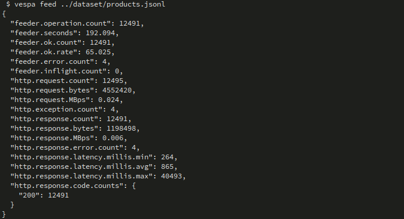
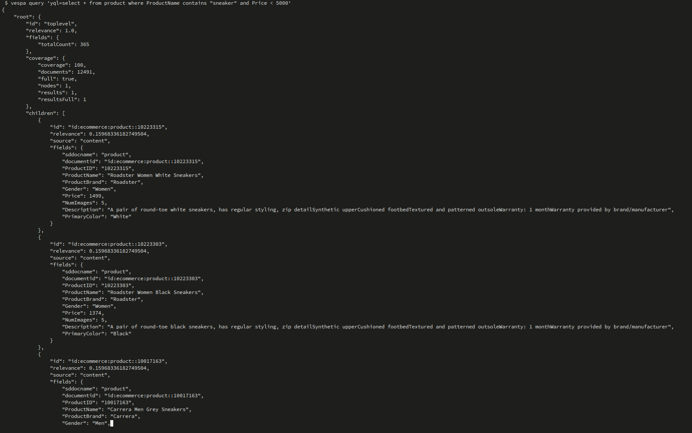
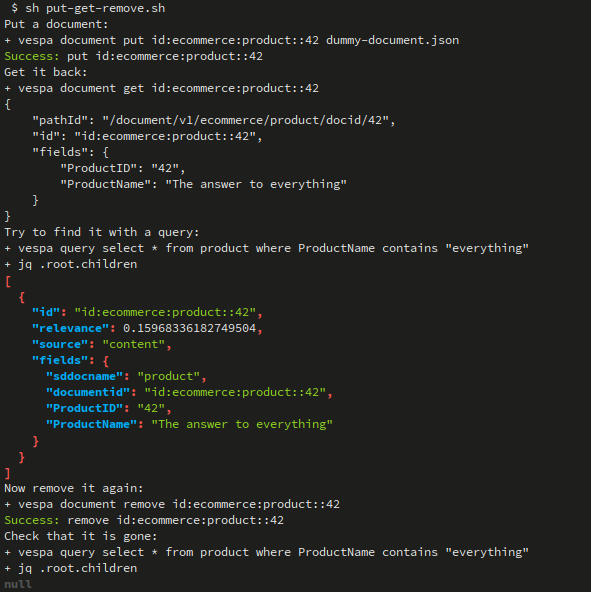
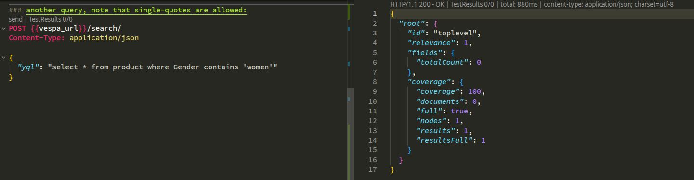

# E-commerce App – Vespa 101 Chapter 2

This project is **Chapter 2** in the Vespa 101 series.  
Chapter 1 (`simple_ecommerce_app`) introduced a tiny schema and very small dataset.  
This chapter upgrades to a **more realistic e-commerce catalog**, larger data, and runs everything on **Vespa Cloud**.

The goal here is **not** to re-teach the basics from Chapter 1, but to show how to:
- Map a **real CSV product catalog** to a Vespa schema
- Deploy a slightly richer **product schema** to Vespa Cloud
- Feed data from **JSONL** into Vespa Cloud

---

## Learning Objectives (Chapter 2)

After completing this chapter you should be able to:

- **Understand a richer product schema** with multiple fields (name, brand, price, etc.)
- **Align schema fields with a CSV header row**
- **Deploy** a Vespa app that looks more like a real catalog **on Vespa Cloud**
- **Convert CSV → JSONL** and feed to Vespa Cloud

If any of these feel unfamiliar, quickly skim `simple_ecommerce_app/README.md` first.

---

## Project Structure

From the `ecommerce_app` root:

```text
ecommerce_app/
├── app/
│   ├── schemas/
│   │   └── product.sd              # Product document schema (edit this)
│   ├── services.xml                # Vespa services config
│   └── validation-overrides.xml    # Validation overrides (used sparingly)
├── dataset/
│   ├── myntra_products_catalog.csv # Original CSV catalog
│   ├── products.jsonl              # Converted JSONL, ready to feed
│   ├── generate_jsonl.py           # Script to convert CSV → JSONL
│   └── logstash.conf               # Logstash pipeline config for CSV → Vespa
├── docs/                           # Additional documentation (optional)
├── img/                            # Screenshots and diagrams (optional)
├── put-get-remove.sh               # Example CRUD operations script
├── example.http                    # Example HTTP queries
├── answers.http                    # Reference/solution HTTP queries
├── dummy-document.json             # Minimal example document
└── README.md                       # This file
```

You will mainly touch:
- `app/schemas/product.sd`
- `dataset/products.jsonl` (or the script that creates it)

---

## Step 1 – Review the Product Catalog (CSV)

Open the CSV:

- File: `dataset/myntra_products_catalog.csv`

Look at the **header row** – it defines what columns your catalog has, for example (names here are illustrative):

- `id`
- `product_title`
- `brand`
- `category`
- `price`
- `rating`
- `image_url`
- `product_url`

Your exact headers may differ, but the key idea:

> **Every column you care about in the CSV should have a corresponding field in `product.sd`.**

---

## Step 2 – Update the Vespa Schema (`product.sd`)

Open:
- `app/schemas/product.sd`

This file defines the **product document schema**.  
Using what you learned in Chapter 1 and the docs in `simple_ecommerce_app/docs/SCHEMAS*.md`, do the following:

1. **Create fields** that match important CSV columns  
   - Example ideas (your names should reflect your actual CSV):
     - `product_title` – `string`, `indexing: summary | index`
     - `brand` – `string`, `indexing: summary | attribute`
     - `category` – `string`, `indexing: summary | index | attribute`
     - `price` – `double`, `indexing: summary | attribute | attribute: fast-search`
     - `rating` – `double`, `indexing: summary | attribute`

2. **Choose indexing modes** per field  
   - **Searchable text** → `index | summary`
   - **Filter/sort fields** → `attribute` (and sometimes `attribute: fast-search`)
   - **Returned in results** → always include `summary`

3. **Keep it simple first**  
   - One `rank-profile default` is enough to start.
   - You can customize ranking (BM25, price/rating boosts, etc.) after data is flowing.

For detailed examples of fields and indexing, see:
- `simple_ecommerce_app/docs/SCHEMAS.md`
- `simple_ecommerce_app/docs/SCHEMAS_REF.md`

---

## Step 3 – Deploy the Application

From the `ecommerce_app` root:

> **Assumption**: You already configured **target** and **application name** in Chapter 1  
> (for example `vespa config set target local` or `cloud`, and `vespa config set application <tenant>.<app>[.<instance>]`).

If you **skipped Chapter 1 setup**, do that first using `simple_ecommerce_app/README.md` (Prerequisites + Setup).

Then deploy this Chapter 2 app:

```bash
cd app

# set the application name something like:
# vespa config set application my-tenant.ecommerce-app

# create the cert
vespa auth cert

# deploy it
vespa deploy --wait 900

# check the status
vespa status
```

Wait for deployment to complete successfully.  
You should see output indicating the application is **ready**.

---

## Step 4 – Feed Data from JSONL

The CSV has already been converted to JSONL using:
- `dataset/generate_jsonl.py`

The resulting file:
- `dataset/products.jsonl`

Each line is a JSON document in Vespa feed format (one product per line).

Feed it:

```bash
vespa feed --progress 3 ../dataset/products.jsonl
```



What this does:
- Sends each JSONL line as a **put document** request to Vespa
- Uses your updated `product.sd` schema to validate and index fields

If feeding fails:
- Check error messages – usually it means **field names/types don’t match** your schema
- Compare:
  - Field names in `products.jsonl`
  - Field names and types in `app/schemas/product.sd`

---

## Step 5 – Verify Data with Simple Queries

Once feeding succeeds, you should verify that documents are searchable. There are **three common ways** to call YQL and the Vespa APIs in this project:

### 5.1 Using the Vespa CLI (interactive)

Run a few basic queries from the CLI (adjust field names to your schema):

```bash
# Return any products
vespa query 'yql=select * from product where true'

# Search by product title
vespa query 'yql=select * from product where ProductName contains "shirt"'

# Filter by price
vespa query 'yql=select * from product where Price < 1000'

# Combined search + filter
vespa query 'yql=select * from product where ProductName contains "sneaker" and Price < 5000'
```



These are similar in spirit to Chapter 1, but now operate on a **much richer schema and larger dataset**.

### 5.2 Using a shell script that calls the Vespa CLI

If you prefer a one-shot script to test basic CRUD, you can also use the helper shell script:

```bash
# change directory to the app root
cd ..

# run the script
sh put-get-remove.sh
```


This script will:
- **Put** a single `product` document using `dummy-document.json`
- **Get** it back by document ID
- **Query** it via YQL to verify search
- **Remove** it again and verify it is gone

You can open `put-get-remove.sh` to see the exact `vespa document` and `vespa query` commands it runs.

### 5.3 Using the HTTP REST API (example.http)

You can also test queries and document APIs using the HTTP request file:

```bash
# In an HTTP client that supports .http files (e.g. VS Code REST Client)
open example.http
```

In `example.http`:
- Set `@vespa_url` at the top to your Vespa Cloud endpoint (see `vespa status`)
- Run the provided requests to:
  - **Sanity check search**: `select * from product where true`
  - **Filter by field**: `select * from product where Gender contains "men"` / `"women"`
  - **Run a grouping query**: counts by `PrimaryColor`
  - **Get a single document** via `GET {{vespa_url}}/document/v1/ecommerce/product/docid/10009781`



**Note**: Setting the tls key certificate
- Open $\text{VS}$ Code Settings ($\mathbf{Ctrl+,}$ or $\mathbf{Cmd+,}$).
- Search for rest-client.certificates.Click "Edit in settings.json" to open your raw configuration file.
- Add a configuration block for the target host that requires the certificate. 
- You must specify the exact host URL (without https://) and the absolute paths to your files. 
- Example:
```json
{
    "rest-client.certificates": {
         "e96a0df2.c66e5c39.z.vespa-app.cloud": { // <--- 1. Match this HOSTNAME to your request URL
            "cert": "/home/user/.vespa/my-tenant.ecommerce-app.default/data-plane-public-cert.pem", // <--- 2. Path to your client certificate
            "key":  "/home/user/.vespa/my-tenant.ecommerce-app.default/data-plane-private-key.pem", // <--- 3. Path to your private key
            "passphrase": "your_key_passphrase" // <--- 4. (Optional) If your key is encrypted
        }
    }
}
```

---

## Exercise – Practice YQL and Ranking

Here are a few practice tasks you can try using any of the three methods above (CLI, shell script adaptation, or `example.http`):

- **1. Make sure the returned shirts are blue or red**  
  - Hint: Use boolean logic on the `PrimaryColor` (or equivalent) field.  
  - Example YQL:  
    `select * from product where ProductName contains "shirt" and (PrimaryColor = "blue" or PrimaryColor = "red")`

- **2. Show shirts where price is under 500**  
  - Hint: Use a numeric comparison on the `Price` field.  
  - Example YQL:  
    `select * from product where ProductName contains "shirt" and Price < 500`

- **3. Get docs whose description contains the phrase "premium cotton"**  
  - Hint: Use `contains` on your description field.  
  - Example YQL:  
    `select * from product where Description contains "premium cotton"`

- **4. Return only the top 5 hits**  
  - Hint: Use `LIMIT 5` and/or the `hits` parameter.  
  - Example YQL:  
    `select * from product where ProductName contains "shirt" limit 5`

- **5. For each hit, return only selected fields**  
  - Hint: Change the `select *` to list fields explicitly.  
  - Example YQL:  
    `select ProductID, ProductName, Description, Price, PrimaryColor from product where true limit 5`

- **6. Change the ranking to BM25 on `ProductName` and compare results**  
  1. In `app/schemas/product.sd`, ensure `ProductName` is indexed text:  
     ```vespa
     field ProductName type string {
         indexing: summary | index
     }
     ```  
  2. Add a new rank profile:  
     ```vespa
     rank-profile bm25_productname inherits default {
         first-phase {
             expression: bm25(ProductName)
         }
     }
     ```  
  3. Redeploy the app so the new profile is available:  
     ```bash
     cd app
     vespa deploy --wait 900
     ```  
     (Rank-profile-only changes do **not** require re-feeding; changing `indexing` might.)
  4. Compare `nativeRank` vs BM25 from the CLI:  
     ```bash
     # nativeRank (default)
     vespa query \
       'yql=select * from product where ProductName contains "shirt"' \
       'ranking=default'

     # BM25 on ProductName
     vespa query \
       'yql=select * from product where ProductName contains "shirt"' \
       'ranking=bm25_productname'
     ```  
     Look at the difference in hit ordering and relevance scores.  
  5. (Optional) Add a BM25 request to `example.http` using `"ranking": "bm25_productname"` to compare via HTTP.

Try implementing these in:
- `vespa query 'yql=…'`  
- `example.http` as additional requests  
- Or by adapting the queries in `answers.http`.

---

## Troubleshooting Tips (Chapter 2 Focus)

- **Schema vs data mismatch**
  - Error: unknown field → Add the field to `product.sd` or remove it from feed
  - Error: wrong type → Make sure CSV/JSONL values convert cleanly to the field type

- **No results in queries**
  - Run: `vespa query 'yql=select * from product where true'`
  - If empty: feeding failed or schema didn’t match

For generic Vespa deployment / CLI issues, reuse the troubleshooting section from Chapter 1.

---

## What You’ve Learned in Chapter 2

By completing this app, you have:

- Taken the **basic concepts from Chapter 1** and applied them to a **real product catalog**
- Learned how to **align a Vespa schema with an external CSV source**
- Practiced **deploying** and **feeding** a larger dataset via JSONL to **Vespa Cloud**

From here, you are ready for more advanced topics:
- Adding **faceted navigation** (brands, categories)
- Implementing **better ranking** (popularity, rating, personalization)
- Moving toward **semantic / vector search** (later chapters)
