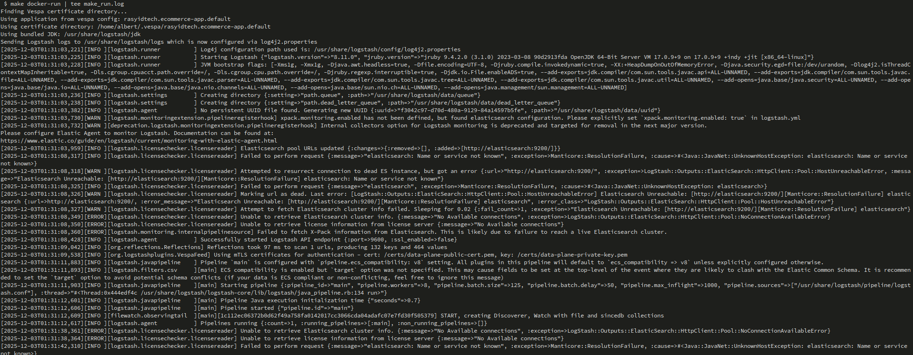

# E-commerce App – Vespa 101 Chapter 2

This project is **Chapter 2** in the Vespa 101 series.  
Chapter 1 (`simple_ecommerce_app`) introduced a tiny schema and very small dataset.  
This chapter upgrades to a **more realistic e-commerce catalog**, larger data, and multiple ingestion options.

The goal here is **not** to re-teach the basics from Chapter 1, but to show how to:
- Map a **real CSV product catalog** to a Vespa schema
- Deploy a slightly richer **product schema**
- Feed data in **two ways**:
  - Directly from **JSONL**
  - Via **Logstash** reading the original CSV

---

## Learning Objectives (Chapter 2)

After completing this chapter you should be able to:

- **Understand a richer product schema** with multiple fields (name, brand, price, etc.)
- **Align schema fields with a CSV header row**
- **Deploy** a Vespa app that looks more like a real catalog
- **Convert CSV → JSONL** and feed to Vespa
- **Use Logstash** to stream data from CSV into Vespa

If any of these feel unfamiliar, quickly skim `simple_ecommerce_app/README.md` first.

---

## Project Structure

From the `ecommerce_app` root:

```text
ecommerce_app/
├── app/
│   ├── schemas/
│   │   └── product.sd              # Product document schema (edit this)
│   ├── services.xml                # Vespa services config
│   └── validation-overrides.xml    # Validation overrides (used sparingly)
├── dataset/
│   ├── myntra_products_catalog.csv # Original CSV catalog
│   ├── products.jsonl              # Converted JSONL, ready to feed
│   ├── generate_jsonl.py           # Script to convert CSV → JSONL
│   └── logstash.conf               # Logstash pipeline config for CSV → Vespa
├── docs/                           # Additional documentation (optional)
├── img/                            # Screenshots and diagrams (optional)
├── put-get-remove.sh               # Example CRUD operations script
├── example.http                    # Example HTTP queries
├── answers.http                    # Reference/solution HTTP queries
├── dummy-document.json             # Minimal example document
└── README.md                       # This file
```

You will mainly touch:
- `app/schemas/product.sd`
- `dataset/products.jsonl` (or the script that creates it)
- `dataset/logstash.conf`

---

## Step 1 – Review the Product Catalog (CSV)

Open the CSV:

- File: `dataset/myntra_products_catalog.csv`

Look at the **header row** – it defines what columns your catalog has, for example (names here are illustrative):

- `id`
- `product_title`
- `brand`
- `category`
- `price`
- `rating`
- `image_url`
- `product_url`

Your exact headers may differ, but the key idea:

> **Every column you care about in the CSV should have a corresponding field in `product.sd`.**

---

## Step 2 – Update the Vespa Schema (`product.sd`)

Open:
- `app/schemas/product.sd`

This file defines the **product document schema**.  
Using what you learned in Chapter 1 and the docs in `simple_ecommerce_app/docs/SCHEMAS*.md`, do the following:

1. **Create fields** that match important CSV columns  
   - Example ideas (your names should reflect your actual CSV):
     - `product_title` – `string`, `indexing: summary | index`
     - `brand` – `string`, `indexing: summary | attribute`
     - `category` – `string`, `indexing: summary | index | attribute`
     - `price` – `double`, `indexing: summary | attribute | attribute: fast-search`
     - `rating` – `double`, `indexing: summary | attribute`

2. **Choose indexing modes** per field  
   - **Searchable text** → `index | summary`
   - **Filter/sort fields** → `attribute` (and sometimes `attribute: fast-search`)
   - **Returned in results** → always include `summary`

3. **Keep it simple first**  
   - One `rank-profile default` is enough to start.
   - You can customize ranking (BM25, price/rating boosts, etc.) after data is flowing.

For detailed examples of fields and indexing, see:
- `simple_ecommerce_app/docs/SCHEMAS.md`
- `simple_ecommerce_app/docs/SCHEMAS_REF.md`

---

## Step 3 – Deploy the Application

From the `ecommerce_app` root:

> **Assumption**: You already configured **target** and **application name** in Chapter 1  
> (for example `vespa config set target local` or `cloud`, and `vespa config set application <tenant>.<app>[.<instance>]`).

If you **skipped Chapter 1 setup**, do that first using `simple_ecommerce_app/README.md` (Prerequisites + Setup).

Then deploy this Chapter 2 app:

```bash
cd app

# set the application name something like:
# vespa config set application my-tenant.ecommerce-app

# create the cert
vespa auth cert

# deploy it
vespa deploy

# check the status
vespa status
```

Wait for deployment to complete successfully.  
You should see output indicating the application is **ready**.

---

## Step 4 – Feed Data from JSONL

The CSV has already been converted to JSONL using:
- `dataset/generate_jsonl.py`

The resulting file:
- `dataset/products.jsonl`

Each line is a JSON document in Vespa feed format (one product per line).

Feed it:

```bash
vespa feed ../dataset/products.jsonl
```


What this does:
- Sends each JSONL line as a **put document** request to Vespa
- Uses your updated `product.sd` schema to validate and index fields

If feeding fails:
- Check error messages – usually it means **field names/types don’t match** your schema
- Compare:
  - Field names in `products.jsonl`
  - Field names and types in `app/schemas/product.sd`

---

## Step 5 – Verify Data with Simple Queries

Once feeding succeeds, try a few basic queries (adjust field names to your schema):

```bash
# Return any products
vespa query 'yql=select * from product where true'

# Search by product title
vespa query 'yql=select * from product where ProductName contains "shirt"'

# Filter by price
vespa query 'yql=select * from product where Price < 1000'

# Combined search + filter
vespa query 'yql=select * from product where ProductName contains "sneaker" and Price < 5000'
```


These are similar in spirit to Chapter 1, but now operate on a **much richer schema and larger dataset**.

---

## Step 6 – Feeding Directly from CSV with Logstash (Optional but Recommended)

Instead of maintaining a separate JSONL file, you can stream from CSV using **Logstash**.

### 6.1 Install Logstash and Vespa Output Plugin

You have two options: **traditional installation** or **Docker**.

#### Option A: Traditional Installation

1. **Install Logstash** (see Elastic download page):
   - `https://www.elastic.co/downloads/logstash`
   - Extract the archive to a directory (e.g., `/opt/logstash` or `~/logstash`)

2. **Install the Vespa output plugin:**

   The `logstash-plugin` command comes **with Logstash** - it's in the `bin/` directory of your Logstash installation.

   **Navigate to your Logstash installation directory**, then run:

   ```bash
   # If Logstash is in /opt/logstash
   cd /opt/logstash
   bin/logstash-plugin install logstash-output-vespa_feed
   
   # Or if Logstash is in ~/logstash
   cd ~/logstash
   bin/logstash-plugin install logstash-output-vespa_feed
   
   # Or use full path
   /path/to/logstash/bin/logstash-plugin install logstash-output-vespa_feed
   ```

   **What this does:**
   - `logstash-plugin` is a utility that comes with Logstash
   - It downloads and installs the `logstash-output-vespa_feed` plugin
   - The plugin allows Logstash to send events directly to Vespa

   **Verify installation:**
   ```bash
   bin/logstash-plugin list | grep vespa
   ```
   
   You should see `logstash-output-vespa_feed` in the output.

#### Option B: Docker Installation (Recommended)

**Using Docker is often easier** - no need to manage Java versions or system dependencies.

1. **Pull the Logstash Docker image:**

```bash
docker pull docker.elastic.co/logstash/logstash:8.11.0
```

2. **Create a custom Docker image with the Vespa plugin:**

   The `logstash-plugin` command is **available inside the Docker container** - it comes with the Logstash image.

   Create a `Dockerfile` in your project root:

   ```dockerfile
   FROM docker.elastic.co/logstash/logstash:8.11.0

   # Install Vespa output plugin
   # logstash-plugin is available in the container's PATH
   RUN logstash-plugin install logstash-output-vespa_feed
   ```

   Build the image:

   ```bash
   docker build -t logstash-vespa:latest .
   ```

   **Or use the Makefile** (simpler):

   ```bash
   make docker-build
   ```

   **What this does:**
   - Uses the official Logstash image as base
   - Runs `logstash-plugin install` inside the container (the command is pre-installed)
   - Creates a custom image with the Vespa plugin already installed
   - This is faster than installing the plugin every time you run the container

3. **Run Logstash with Docker:**

   **Manual command:**

   ```bash
   docker run --rm -it \
     -v $(pwd)/dataset/logstash.conf:/usr/share/logstash/pipeline/logstash.conf:ro \
     -v $(pwd)/dataset:/data:ro \
     --network host \
     logstash-vespa:latest
   ```

   **Or use the Makefile** (simpler):

   ```bash
   make docker-run
   ```

   The Makefile automatically handles the volume mounts and network configuration.

**What this does:**
- `-v $(pwd)/dataset/logstash.conf:...` - Mounts your config file
- `-v $(pwd)/dataset:/data:ro` - Mounts dataset directory (read-only)
- `--network host` - Allows Logstash to connect to Vespa on localhost
- `logstash-vespa:latest` - Uses your custom image with Vespa plugin

**Alternative: Install plugin at runtime** (if you don't want to build a custom image):

```bash
docker run --rm -it \
  -v $(pwd)/dataset/logstash.conf:/usr/share/logstash/pipeline/logstash.conf:ro \
  -v $(pwd)/dataset:/data:ro \
  --network host \
  docker.elastic.co/logstash/logstash:8.11.0 \
  bash -c "logstash-plugin install logstash-output-vespa_feed && logstash -f /usr/share/logstash/pipeline/logstash.conf"
```

**What this does:**
- Runs the official Logstash image
- Uses `logstash-plugin` (available in the container) to install the plugin
- Then runs Logstash with your config

**Note:** The plugin installation happens each time you run the container (slower startup, but no need to build a custom image).

**For production:** Build a custom image (step 2 above) for faster startup.

### 6.2 Configure `logstash.conf`

Open:
- `dataset/logstash.conf`

**IMPORTANT: Fix the file input path**

The `path` setting in the `file` input is commented out. You **must** uncomment it and set the correct path.

**For Docker (recommended):**

Since we mount the dataset directory to `/data` in Docker, update the path:

```ruby
input {
    file {
        # Uncomment and set this path for Docker:
        path => "/data/myntra_products_catalog.csv"
        sincedb_path => "/dev/null"
        start_position => "beginning"
        # ... rest of config
    }
}
```

**For traditional installation:**

Use the absolute path to your CSV file:

```ruby
input {
    file {
        # Uncomment and set this to your absolute path:
        path => "/absolute/path/to/dataset/myntra_products_catalog.csv"
        sincedb_path => "/dev/null"
        start_position => "beginning"
        # ... rest of config
    }
}
```

**Also check:**
- Field names in the Logstash pipeline match your **CSV columns**
- The Vespa output section points to your **Vespa endpoint**:
  - **For local Vespa**: `vespa_url => "http://localhost:8080"` (no certificates needed)
  - **For Vespa Cloud**: 
    1. Update `vespa_url` to your Cloud endpoint (find with `vespa status`)
    2. **IMPORTANT**: Vespa Cloud requires mTLS certificates. Get them by running:
       ```bash
       vespa auth cert
       ```
       This creates certificate files in `~/.vespa/<tenant>/<app>/<instance>/`
    3. The Makefile automatically detects and mounts certificates:
       - First tries to use `vespa config get application`
       - Then tries to match directory name (e.g., `ecommerce_app`)
       - Falls back to finding any certificate directory
    4. **Manual override**: If auto-detection fails, set `VESPA_CERT_DIR`:
       ```bash
       export VESPA_CERT_DIR=~/.vespa/<tenant>.<app>.<instance>
       make docker-run
       ```
    5. The certificates are referenced in `logstash.conf`:
       ```ruby
       client_cert => "/certs/data-plane-public-cert.pem"
       client_key => "/certs/data-plane-private-key.pem"
       ```
  - Default: `vespa_url => "http://localhost:8080"`

### 6.3 Run Logstash

#### If using traditional installation:

From your Logstash installation:

```bash
bin/logstash -f $PATH_TO_LOGSTASH_CONF/logstash.conf
```

#### If using Docker:

**Manual command:**

```bash
docker run --rm -it \
  -v $(pwd)/dataset/logstash.conf:/usr/share/logstash/pipeline/logstash.conf:ro \
  -v $(pwd)/dataset:/data:ro \
  --network host \
  logstash-vespa:latest
```

**Or use the Makefile** (recommended):

```bash
make docker-run
```

**What this does:**
- Reads rows from `myntra_products_catalog.csv`
- Transforms them according to the pipeline
- Sends them as feed operations into Vespa

**Note:** Make sure your `logstash.conf` uses absolute paths or paths relative to `/data` when running in Docker.

**Quick Reference - Makefile Commands:**

```bash
# Build the Logstash Docker image with Vespa plugin
make docker-build

# Test Logstash configuration (validate before running)
make docker-test-config

# Check if Vespa plugin is installed
make docker-check-plugin

# List available Vespa certificate directories
make docker-list-certs

# Run Logstash with Docker (feeds data to Vespa)
# Automatically detects certificate directory, or use:
export VESPA_CERT_DIR=~/.vespa/<tenant>.<app>.<instance>
make docker-run
```



The Makefile is located in the project root and handles all the Docker configuration automatically.

**Certificate Detection:**
The Makefile tries to find certificates in this order:
1. Uses `VESPA_CERT_DIR` environment variable (if set)
2. Uses `vespa config get application` to get the configured app
3. Matches directory name (e.g., `ecommerce_app` matches `*ecommerce_app*`)
4. Falls back to first certificate directory found

If detection fails, the Makefile will show available certificate directories and instructions.

**Troubleshooting Logstash Configuration Errors:**

If you see configuration errors when running `make docker-run`:

1. **Verify the Vespa plugin is installed:**
   ```bash
   make docker-check-plugin
   ```
   You should see `logstash-output-vespa_feed` in the output.
   
   **If the plugin is NOT listed**, rebuild the Docker image:
   ```bash
   make docker-build
   ```

2. **Test the configuration with verbose output:**
   ```bash
   make docker-test-config-verbose
   ```
   This will show detailed error messages about what's wrong with your configuration.

   **Note:** If you see "Connection refused" errors during config test:
   - This is **normal** if Vespa isn't running or accessible
   - The plugin tries to validate the connection during config test
   - The config is still valid - it will work when Vespa is accessible
   - For Vespa Cloud: Make sure `vespa_url` points to your Cloud endpoint, not `localhost:8080`

3. **Check common issues:**
   - **Missing `path` setting** (MOST COMMON): The `path =>` line in the `file` input is commented out. You must uncomment it and set the correct path.
     - ✅ For Docker: `path => "/data/myntra_products_catalog.csv"`
     - ❌ Wrong: `# path => "/PATH/TO/..."` (commented out)
   - **Plugin not installed**: If `make docker-check-plugin` shows no vespa plugin, rebuild: `make docker-build`
   - **File paths in logstash.conf**: Make sure CSV file paths are correct. In Docker, use `/data/` prefix for files in the dataset directory.
     - ✅ Correct: `path => "/data/myntra_products_catalog.csv"`
     - ❌ Wrong: `path => "/absolute/path/to/dataset/myntra_products_catalog.csv"` (when using Docker)
   - **Syntax errors**: Check `logstash.conf` for:
     - Missing brackets `{ }`
     - Missing commas
     - Incorrect plugin names
     - Typos in field names

4. **Manual debugging** (if Makefile commands don't help):
   ```bash
   # Check plugin installation
   docker run --rm logstash-vespa:latest logstash-plugin list | grep vespa
   
   # Test config with full debug output
   docker run --rm -it \
     -v $(pwd)/dataset/logstash.conf:/usr/share/logstash/pipeline/logstash.conf:ro \
     logstash-vespa:latest \
     logstash --config.test_and_exit --config.debug --log.level=debug
   ```

**Most Common Issue:** The `logstash-output-vespa_feed` plugin might not be installed. Always run `make docker-check-plugin` first to verify.

For more examples and patterns, see:
- Blog: `https://blog.vespa.ai/logstash-vespa-tutorials/`

---

## Troubleshooting Tips (Chapter 2 Focus)

- **Schema vs data mismatch**
  - Error: unknown field → Add the field to `product.sd` or remove it from feed
  - Error: wrong type → Make sure CSV/JSONL values convert cleanly to the field type

- **No results in queries**
  - Run: `vespa query 'yql=select * from product where true'`
  - If empty: feeding failed or schema didn’t match

- **Logstash feed is slow or failing**
  - Check Logstash logs
  - Confirm Vespa host/port in `logstash.conf`
  - Confirm plugin installed correctly

For generic Vespa deployment / CLI / Docker issues, reuse the troubleshooting section from Chapter 1.

---

## What You’ve Learned in Chapter 2

By completing this app, you have:

- Taken the **basic concepts from Chapter 1** and applied them to a **real product catalog**
- Learned how to **align a Vespa schema with an external CSV source**
- Practiced **deploying** and **feeding** a larger dataset via JSONL
- Used **Logstash** as an alternative ingestion path from CSV → Vespa

From here, you are ready for more advanced topics:
- Adding **faceted navigation** (brands, categories)
- Implementing **better ranking** (popularity, rating, personalization)
- Moving toward **semantic / vector search** (later chapters)
