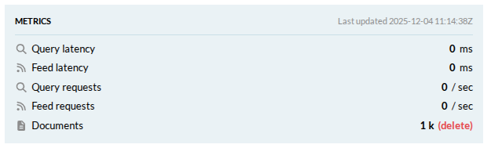
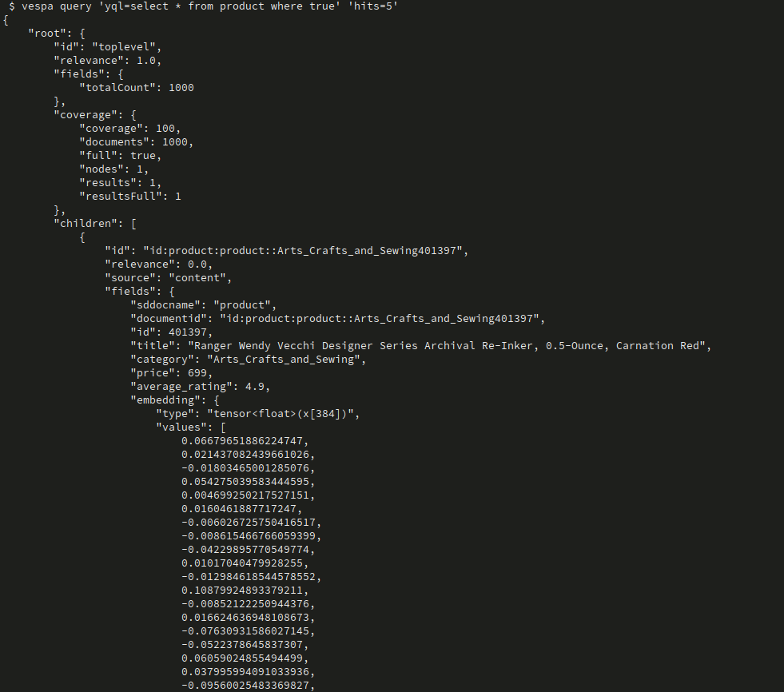
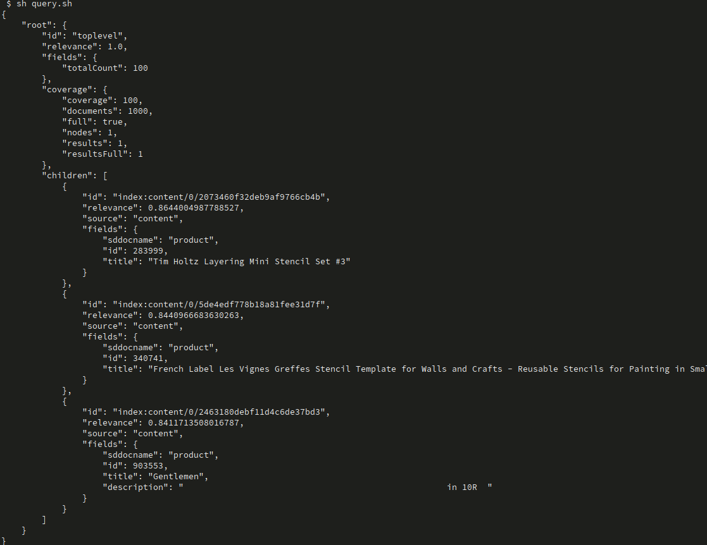
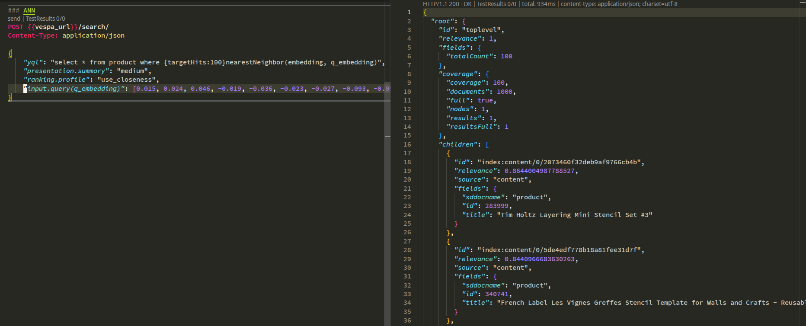
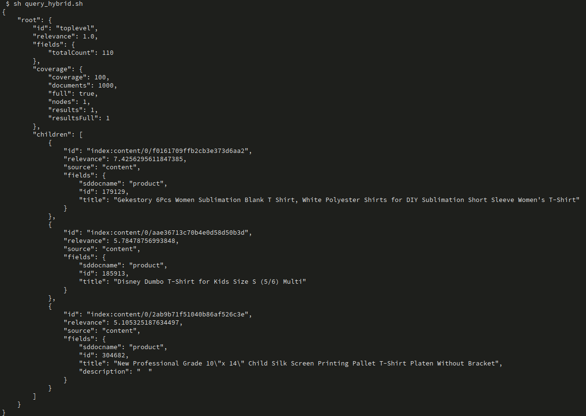

# Semantic E-commerce App – Vespa 101 Chapter 3

This project is **Chapter 3** in the Vespa 101 series.  
Chapter 2 (`ecommerce_app`) introduced a full product catalog with text search.  
This chapter adds **semantic search** using vector embeddings and **Approximate Nearest Neighbor (ANN)** search with HNSW indexing.

The goal here is to learn how to:
- Add **embedding fields** to your Vespa schema
- Configure **HNSW indexing** for fast ANN search
- Feed documents with **pre-computed embeddings**
- Query using **nearest neighbor search** for semantic similarity
- Use **ranking profiles** that leverage vector similarity

---

## Learning Objectives (Chapter 3)

After completing this chapter you should be able to:

- **Understand embedding fields** and tensor types in Vespa schemas
- **Configure HNSW indexing** for approximate nearest neighbor search
- **Feed documents with vector embeddings** (pre-computed)
- **Query using `nearestNeighbor()`** operator for semantic search
- **Use `closeness()` ranking** to score by vector similarity
- **Combine text and semantic search** for hybrid retrieval

**Prerequisites**: Complete Chapter 2 (`ecommerce_app`) first. If you haven't, review:
- `ecommerce_app/README.md` for schema basics and deployment
- `simple_ecommerce_app/README.md` for fundamental concepts

---

## Project Structure

From the `semantic_ecommerce_app` root:

```text
semantic_ecommerce_app/
├── app/
│   ├── schemas/
│   │   └── product.sd              # Product schema with embedding field
│   ├── services.xml                # Vespa services config
│   └── validation-overrides.xml    # Validation overrides (used sparingly)
├── dataset/
│   └── products.jsonl              # Products with pre-computed embeddings
├── docs/
│   └── ANN_SEARCH.md               # Comprehensive ANN/HNSW reference guide
├── queries.http                    # Example ANN queries
├── query-template.http             # Template for building ANN queries
└── README.md                       # This file
```

You will mainly work with:
- `app/schemas/product.sd` - Schema with embedding field and HNSW configuration
- `dataset/products.jsonl` - Data with embeddings (384-dimensional vectors)
- `query-template.http` - Template for ANN queries

---

## Key Concepts

### What is Semantic Search?

**Semantic search** finds documents based on **meaning** rather than exact keyword matches. It uses **vector embeddings** (dense numerical representations) to capture semantic relationships.

**Example**:
- Traditional search: "blue jeans" only matches documents containing those exact words
- Semantic search: "blue jeans" can match "denim pants", "navy trousers", etc., based on meaning

### Embeddings

- **Dense vectors** (typically 128-1536 dimensions)
- Generated by ML models (e.g., E5, BERT, sentence-transformers)
- Similar meanings → similar vectors → close in vector space

### HNSW (Hierarchical Navigable Small World)

- **Graph-based index** for fast approximate nearest neighbor search
- Balances **speed**, **accuracy**, and **memory**
- Configurable via `max-links-per-node` and `neighbors-to-explore-at-insert`

### ANN Search

- **Approximate Nearest Neighbor** search finds similar vectors quickly
- Uses `nearestNeighbor()` operator in YQL
- Controlled by `targetHits` parameter (recall vs. speed trade-off)

**For detailed documentation**, see: [`docs/ANN_SEARCH.md`](docs/ANN_SEARCH.md)

---

## Step 1 – Review the Schema

Open:
- `app/schemas/product.sd`

This schema extends Chapter 2's schema with an **embedding field**:

```javascript
field embedding type tensor<float>(x[384]) {
  indexing: attribute | index | summary
  attribute {
    distance-metric: prenormalized-angular
  }
  index {
    hnsw {
      max-links-per-node: 16
      neighbors-to-explore-at-insert: 200
    }
  }
}
```

### Key Components

1. **Tensor Type**: `tensor<float>(x[384])` - 384-dimensional float vector
2. **Indexing**: 
   - `attribute` - For distance computation
   - `index` - For HNSW graph structure
   - `summary` - For debugging (remove in production)
3. **Distance Metric**: `prenormalized-angular` - Cosine similarity for normalized vectors
4. **HNSW Configuration**: Tuned for balanced performance

### Ranking Profiles

The schema includes three ranking profiles:

1. **`use_bm25`**: Text-only ranking (from Chapter 2)
2. **`use_closeness`**: Semantic similarity ranking
   ```javascript
   rank-profile use_closeness {
     inputs {
       query(q_embedding) tensor<float>(x[384])
     }
     first-phase {
       expression: closeness(field, embedding)
     }
   }
   ```
3. **`hybrid`**: Combines text (BM25) + semantic (closeness)

**For detailed schema configuration**, see: [`docs/ANN_SEARCH.md#schema-configuration`](docs/ANN_SEARCH.md#schema-configuration)

---

## Step 2 – Deploy the Application

From the `semantic_ecommerce_app` root:

> **Assumption**: You already configured **target** and **application name** in previous chapters  
> (for example `vespa config set target cloud`, and `vespa config set application <tenant>.<app>[.<instance>]`).

If you **skipped previous chapters**, do that first using `ecommerce_app/README.md` (Prerequisites + Setup).

Then deploy this Chapter 3 app:

```bash
cd app

# Verify your application configuration
vespa config get target        # Should show: cloud

# Set the application target if it is not cloud
# $ vespa config set target cloud

vespa config get application   # Should show: tenant.app.instance

# Set the application name if it is not already set
# $ vespa config set application my-tenant.ecommerce-app

# Login if needed
vespa auth login

# Create certificates if needed
vespa auth cert

# Deploy the application
vespa deploy --wait 900

# Check the status
vespa status
```

Wait for deployment to complete successfully.  
You should see output indicating the application is **ready**.

**Note**: The schema includes HNSW indexing, which may take longer to initialize than text-only indexes.

---

## Step 3 – Delete Existing Documents (If Any)

> **Important**: If you have existing documents from Chapter 2, delete them first to avoid conflicts or setup the new application.

### Option 1: Using Vespa Cloud Console

1. Go to your application in [Vespa Cloud](https://console.vespa.ai/)
2. Navigate to the **Metrics** section
3. Find the **Documents** count
4. Click **"(delete)"** to remove all documents



**Note**: Deleting documents may take a while. Give it half a minute to complete before feeding data in the next step.

### Option 2: Using Document API

You can also use the Document v1 API to delete documents programmatically:

```bash
# Delete all documents (example - adjust document IDs to match your data)
vespa document remove id:ecommerce:product::1
vespa document remove id:ecommerce:product::2
```

### Option 3: Query and Delete

```bash
# First, query to see what documents exist
vespa query 'yql=select * from product where true'

# Then delete specific documents by ID
vespa document remove <document-id>
```

### Option 4: Bulk Delete Script

```bash
# Using a loop to delete all document IDs
# This script queries all documents, extracts their IDs, and deletes them using jq
vespa query 'yql=select * from product where true' 'hits=1000' | \
  jq -r '.root.children[].id' | \
  while read doc_id; do
    echo "Deleting document: $doc_id"
    vespa document remove "$doc_id"
  done
```


**Note**: 
- Adjust `hits=1000` if you have more documents (or remove limit to get all)
- The script processes documents in batches - if you have many documents, you may need to run it multiple times
- For very large datasets, consider using the Vespa Cloud Console delete option instead
---

## Step 4 – Feed the Sample Data

The dataset contains products with **pre-computed embeddings** (384-dimensional vectors).

**File**: `dataset/products.jsonl`

Each line is a JSON document with an `embedding` field containing a vector array.

### Feed the Data

```bash
# From the semantic_ecommerce_app root directory
vespa feed --progress 3 ../dataset/products.jsonl
```

**What this does**:
- Sends each JSONL line as a **put document** request to Vespa
- The `embedding` field is indexed using **HNSW** for fast ANN search
- Documents are validated against the schema (embedding must be 384 dimensions)

**Note**: In this exercise, we feed data that **contains vectors as fields**. Vespa also supports **on-the-fly embedding** generation (using embedder components), which we'll learn in following assignments.

### Verify Data Was Fed

Check that documents were successfully indexed:

```bash
vespa query 'yql=select * from product where true' 'hits=5'
```



You should see products with their embeddings indexed.

**If feeding fails**:
- Check error messages – usually means **field names/types don't match** your schema
- Verify `embedding` field is a 384-element array in JSONL
- Compare field names in `products.jsonl` with `app/schemas/product.sd`

---

## Step 5 – Run an ANN Query

Now that data is fed, you can perform **Approximate Nearest Neighbor (ANN)** searches.

### Option 1: Using Vespa CLI

**Note**: Refer to the [Nearest Neighbor Search documentation](https://docs.vespa.ai/en/querying/nearest-neighbor-search-guide.html) to understand the query syntax and various options from the template.

**Note**: The embedding vector must be 384 dimensions (matching your schema).

If you have a query embedding vector, you can use the CLI:

```bash
vespa query \
  'yql=select * from product where {targetHits:100}nearestNeighbor(embedding, q_embedding)' \
  'ranking.profile=use_closeness' \
  'input.query(q_embedding)=[0.015, 0.024, 0.046, ...]' \
  'hits=10' \
  'presentation.summary=medium'
```

```bash
# call the query from script
sh query.sh
```



### Option 2: Using Query REST Client

Fill in the template in the file `query-template.http` using a code editor (e.g., VS Code with REST Client plugin) and run the query.

**The Template File**: `query-template.http`  

**Steps**:
1. Open `query-template.http` in your editor
2. Replace `<mTLS_ENDPOINT_DNS_GOES_HERE>` with your Vespa Cloud endpoint (from `vespa status`)
3. Fill in the YQL query clause:
   ```yql
   select * from product where {targetHits:100}nearestNeighbor(embedding, q_embedding)
   ```
4. Replace the `input.query(q_embedding)` array with your query embedding vector
5. Run the query using REST Client or similar tool

**The Example File**: `queries.http`  

1. **Verify data was fed**:
   ```json
   {
     "yql": "select * from product where true",
     "presentation.summary": "medium"
   }
   ```

2. **ANN search**:
   ```json
   {
     "yql": "select * from product where {targetHits:100}nearestNeighbor(embedding, q_embedding)",
     "presentation.summary": "medium",
     "ranking.profile": "use_closeness",
     "input.query(q_embedding)": [0.015, 0.024, ...]
   }
   ```




### Understanding the Query

**Components**:
- `{targetHits:100}` - Controls recall vs. speed (higher = better recall, slower)
- `nearestNeighbor(embedding, q_embedding)` - ANN search operator
  - `embedding` - Document field name
  - `q_embedding` - Query parameter name
- `ranking.profile=use_closeness` - Uses `closeness()` function for similarity scoring
- `input.query(q_embedding)` - The query embedding vector (384 dimensions)

**For detailed query syntax**, see: [`docs/ANN_SEARCH.md#query-syntax`](docs/ANN_SEARCH.md#query-syntax)

---

## Step 6 – Experiment with Different Queries

### 6.1 Basic ANN Search

Find products similar to a query embedding:

```bash
vespa query \
  'yql=select * from product where {targetHits:100}nearestNeighbor(embedding, q_embedding)' \
  'ranking.profile=use_closeness' \
  'input.query(q_embedding)=[0.1, 0.2, ...]' \
  'hits=10'
```

### 6.2 ANN with Filters

Combine semantic search with attribute filters:

```bash
vespa query \
  'yql=select * from product where {targetHits:100}nearestNeighbor(embedding, q_embedding) and price < 1000 and category = "electronics"' \
  'ranking.profile=use_closeness' \
  'input.query(q_embedding)=[0.1, 0.2, ...]' \
  'hits=10'
```

### 6.3 Hybrid Search (Text + Semantic)

Combine BM25 text search with semantic search:

```bash
vespa query \
  'yql=select * from product where userQuery() or {targetHits:100}nearestNeighbor(embedding, q_embedding)' \
  'ranking.profile=hybrid' \
  'query="blue jeans"' \
  'input.query(q_embedding)=[0.1, 0.2, ...]' \
  'hits=10'
```

### 6.4 Adjust targetHits

Experiment with different `targetHits` values:

- **Lower (faster)**: `{targetHits:50}` - Faster queries, potentially lower recall
- **Default (balanced)**: `{targetHits:100}` - Good balance
- **Higher (better recall)**: `{targetHits:500}` - Better recall, slower queries

```bash
# Fast query
vespa query \
  'yql=select * from product where {targetHits:50}nearestNeighbor(embedding, q_embedding)' \
  'ranking.profile=use_closeness' \
  'input.query(q_embedding)=[0.1, 0.2, ...]'

# Better recall
vespa query \
  'yql=select * from product where {targetHits:500}nearestNeighbor(embedding, q_embedding)' \
  'ranking.profile=use_closeness' \
  'input.query(q_embedding)=[0.1, 0.2, ...]'
```

**For more examples**, see: [`docs/ANN_SEARCH.md#complete-examples`](docs/ANN_SEARCH.md#complete-examples)

---

## Exercise – Practice ANN Queries

Here are practice tasks to try:

### 1. Compare Ranking Profiles

Run the same query with different ranking profiles:

```bash
# Semantic only (closeness)
vespa query \
  'yql=select * from product where {targetHits:100}nearestNeighbor(embedding, q_embedding)' \
  'ranking.profile=use_closeness' \
  'input.query(q_embedding)=[0.1, 0.2, ...]'

# Text only (BM25)
vespa query \
  'yql=select * from product where title contains "shirt"' \
  'ranking.profile=use_bm25'

# Hybrid (both)
vespa query \
  'yql=select * from product where (title contains "shirt") or ({targetHits:100}nearestNeighbor(embedding, q_embedding))' \
  'ranking.profile=hybrid' \
  'query="shirt"' \
  'input.query(q_embedding)=[0.1, 0.2, ...]'
```

```bash
# call the query hybrid from script
sh query_hybrid.sh
```




Compare the results and relevance scores.

### 2. Tune targetHits

Experiment with different `targetHits` values and observe:
- Query latency (time to respond)
- Result quality (are relevant documents appearing?)
- Recall (are you finding all relevant documents?)

### 3. Combine with Filters

Try combining ANN search with various filters:
- Price range: `price < 1000`
- Category: `category = "electronics"`
- Rating: `average_rating > 4.0`

### 4. Multi-Field Search

If your schema has multiple embedding fields, try searching across them:

```yql
select * from product where 
  {targetHits:100}nearestNeighbor(title_embedding, q_title) 
  or {targetHits:100}nearestNeighbor(description_embedding, q_desc)
```

---

## Understanding HNSW Configuration

The schema includes HNSW configuration:

```javascript
index {
  hnsw {
    max-links-per-node: 16
    neighbors-to-explore-at-insert: 200
  }
}
```

### Parameters

- **`max-links-per-node`** (M): Controls graph connectivity
  - Higher = better accuracy, more memory, slower writes
  - Default: 16 (good balance)
  - Range: 4-64 typically

- **`neighbors-to-explore-at-insert`** (ef_construction): Controls graph quality
  - Higher = better graph quality, slower indexing
  - Default: 200 (good balance)
  - Range: 50-1000+ typically

### Tuning Guidelines

**For Production** (high accuracy):
```javascript
hnsw {
  max-links-per-node: 32
  neighbors-to-explore-at-insert: 400
}
```

**For Development** (fast indexing):
```javascript
hnsw {
  max-links-per-node: 16
  neighbors-to-explore-at-insert: 100
}
```

**For detailed HNSW tuning**, see: [`docs/ANN_SEARCH.md#hnsw-index-parameters`](docs/ANN_SEARCH.md#hnsw-index-parameters)

---

## Destory The Deployment

**Note:** Destroy the application if needed:
   ```bash
   vespa destroy
   ```
---

## Troubleshooting

### Issue: Low Recall (Missing Relevant Results)

**Symptoms**: Relevant documents not appearing in top results

**Solutions**:
1. **Increase `targetHits`**: Try 200, 500, or 1000
2. **Increase HNSW parameters**: Try `max-links-per-node: 32` or `neighbors-to-explore-at-insert: 400`
3. **Check distance metric**: Ensure it matches your embedding model
4. **Verify embeddings**: Check that document embeddings are correct

### Issue: Slow Queries

**Symptoms**: High query latency

**Solutions**:
1. **Decrease `targetHits`**: Try 50 or 100
2. **Check embedding dimension**: Larger dimensions = slower queries
3. **Monitor memory**: Ensure sufficient RAM for HNSW graph

### Issue: Embedding Dimension Mismatch

**Symptoms**: Schema validation errors or query failures

**Solutions**:
1. **Verify model output**: Check actual embedding dimension
2. **Update schema**: Match tensor dimension exactly (384 in this case)
3. **Check query tensor**: Ensure query embedding has same dimension

### Issue: No Results Returned

**Solutions**:
1. **Verify data is fed**: `vespa query 'yql=select * from product where true'`
2. **Check query syntax**: Ensure `nearestNeighbor()` syntax is correct
3. **Verify embedding field name**: Must match schema field name
4. **Enable tracing**: `vespa query 'yql=...' 'traceLevel=5'`

**For comprehensive troubleshooting**, see: [`docs/ANN_SEARCH.md#troubleshooting`](docs/ANN_SEARCH.md#troubleshooting)

---

## What You've Learned in Chapter 3

By completing this app, you have:

- Learned how to **add embedding fields** to Vespa schemas
- Configured **HNSW indexing** for fast ANN search
- Fed documents with **pre-computed embeddings**
- Performed **semantic search** using `nearestNeighbor()` operator
- Used **`closeness()` ranking** for vector similarity scoring
- Combined **text and semantic search** for hybrid retrieval

From here, you are ready for more advanced topics:
- **Query-time embedding generation** (using embedder components)
- **Hybrid search with RRF** (Reciprocal Rank Fusion)
- **Advanced ranking** (multi-phase, custom functions)
- **RAG applications** (Retrieval-Augmented Generation)

---

## Additional Resources

### Documentation

- **Comprehensive ANN Reference**: [`docs/ANN_SEARCH.md`](docs/ANN_SEARCH.md) - Complete guide to HNSW, ANN queries, ranking, and best practices
- **Vespa HNSW Docs**: https://docs.vespa.ai/en/querying/approximate-nn-hnsw.html
- **Nearest Neighbor Guide**: https://docs.vespa.ai/en/querying/nearest-neighbor-search-guide.html
- **Embedding Management**: https://docs.vespa.ai/en/rag/embedding.html

### Related Tutorials

- **Chapter 1**: `simple_ecommerce_app/README.md` - Basic schema and queries
- **Chapter 2**: `ecommerce_app/README.md` - Full catalog with text search
- **Chapter 4**: Hybrid search with RRF

### Query Examples

- `queries.http` - Example ANN queries
- `query-template.http` - Template for building your own queries

---

## Next Steps

After mastering semantic search, proceed to:

- **Chapter 4**: Hybrid Search - Combine text (BM25) and semantic (ANN) with RRF ranking
- **Advanced Ranking**: Multi-phase ranking, custom rerankers
- **RAG Applications**: Build Retrieval-Augmented Generation systems with Vespa

---

## Summary

This chapter introduced:

1. **Embedding fields** - Tensor fields for vector representations
2. **HNSW indexing** - Fast approximate nearest neighbor search
3. **ANN queries** - `nearestNeighbor()` operator with `targetHits`
4. **Semantic ranking** - `closeness()` function for similarity scoring
5. **Hybrid search** - Combining text and semantic search

**Key takeaway**: Semantic search enables finding documents by **meaning**, not just keywords, making search more intuitive and powerful.

For detailed technical reference, see: [`docs/ANN_SEARCH.md`](docs/ANN_SEARCH.md)

