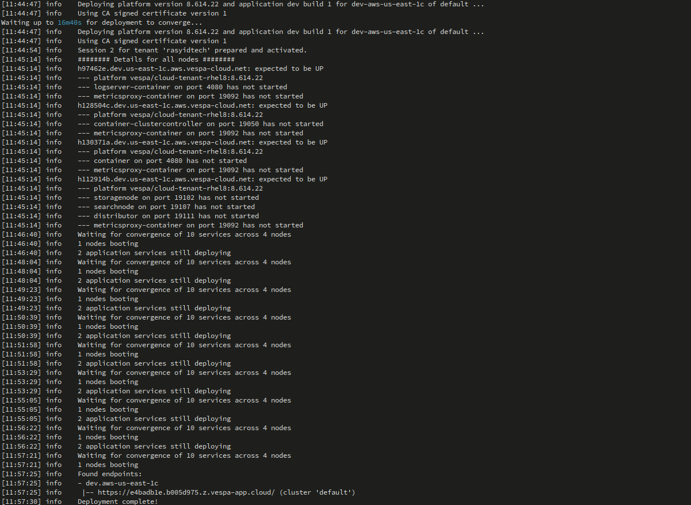
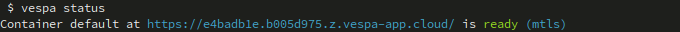
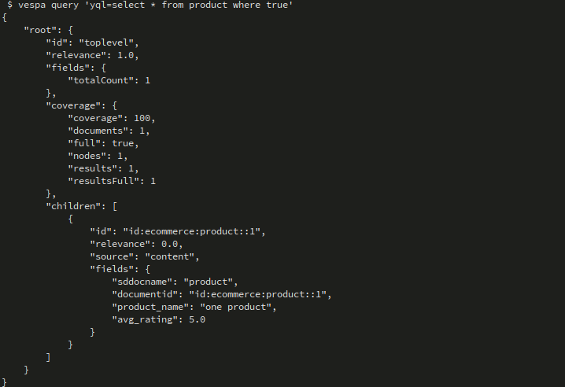
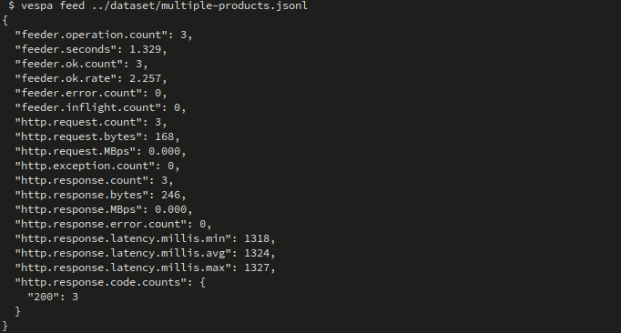
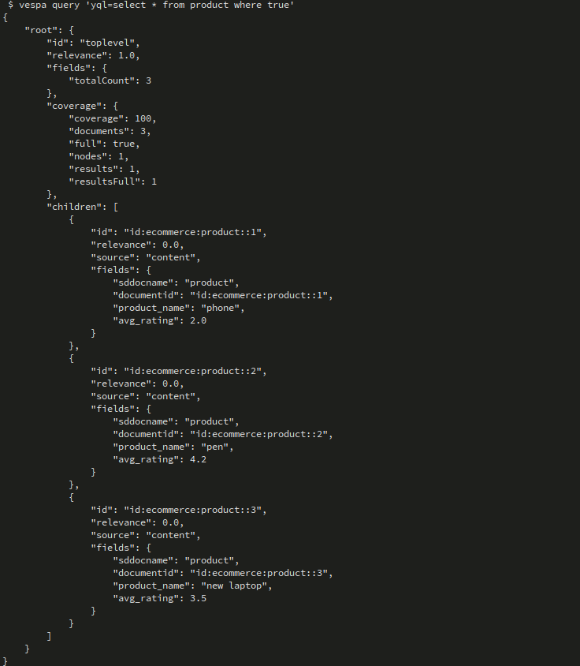
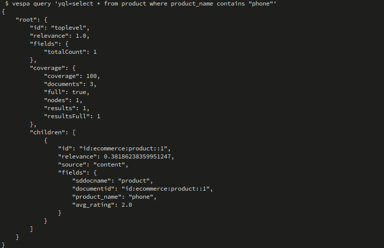
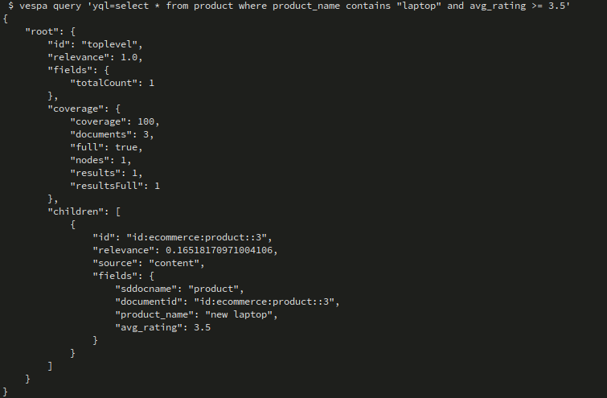
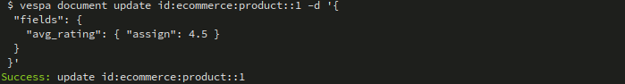
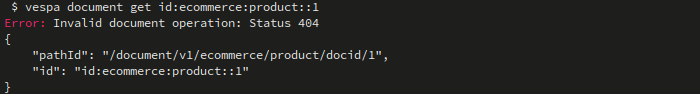
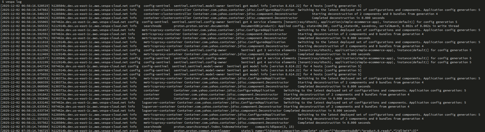

# Simple E-commerce App - Vespa 101 Chapter 1

This is the first tutorial in the **Vespa 101 Fundamentals** course, introducing you to the basics of building a Vespa search application.

## Learning Objectives

By completing this tutorial, you will learn:

- How to define a basic document schema in Vespa
- Understanding simple field types (`string`, `float`)
- Configuring indexing and attribute settings
- Deploying a Vespa application
- Feeding documents to Vespa
- Performing basic queries

## Concepts Covered

- **Basic document schema definition**: Creating a schema file (`.sd`) to define document structure
- **Simple field types**: Using `string` and `float` field types
- **Indexing and attribute configuration**: Understanding the difference between `index` and `attribute` indexing modes

## Project Structure

```
simple_ecommerce_app/
├── app/
│   ├── schemas/
│   │   └── product.sd                      # Document schema definition
│   ├── security/                          # Security configuration (certs/keys)
│   └── services.xml                       # Vespa service configuration
├── dataset/
│   ├── multiple-products-original.jsonl   # Original sample batch data
│   └── multiple-products.jsonl            # Adjusted batch data for this tutorial
├── docs/
│   ├── SCHEMAS.md                         # Extended explanation of schemas
│   └── SCHEMAS_REF.md                     # Schema reference notes
├── img/                                   # Screenshots used in this README
├── sample-product.json                    # Example single document
└── README.md                              # This file
```

## Schema Overview

The product schema defines a simple document with two fields:

```javascript
schema product {
    document product {
        field product_name type string {
            indexing: summary | index
        }
        
        field avg_rating type float {
            indexing: summary | attribute
        }
    }
}
```

### Field Definitions

- **`product_name`** (string):
  - `summary`: Field is stored and returned in search results
  - `index`: Field is indexed for full-text search
  
- **`avg_rating`** (float):
  - `summary`: Field is stored and returned in search results
  - `attribute`: Field is stored in-memory for fast filtering, sorting, and grouping

## Prerequisites

Before starting, ensure you have:

1. **Vespa CLI installed**:
   ```bash
   # macOS
   brew install vespa-cli
   
   # Linux
   Download from:
   https://github.com/vespa-engine/vespa/releases
   
   # Verify installation
   vespa version
   ```

2. **Vespa Cloud account**:
   - Sign up at https://cloud.vespa.ai/
   - Free tier available at https://vespa.ai/free-trial/

## Setup

### Vespa Cloud

1. **Configure Vespa CLI for cloud**:
   ```bash
   # set the application target
   vespa config set target cloud

   # set application name 
   # $ vespa config set application <tenant>.<application>
   # or with instance name (by default the instance name is default)
   # $ vespa config set application <tenant>.<application>.<instance>

   # set the application name something like:
   vespa config set application my-tenant.simple-ecommerce-app
   ```
**Notes**: on Vespa Cloud naming rules:
- Must start with a letter
- Max 40 characters
- Only lowercase letters, digits, or dashes
- No double-dashes

2. **Authenticate**:
   ```bash
   vespa auth login
   vespa auth cert
   ```

3. **Verify configuration**:
   ```bash
   vespa config get target        # Should show: cloud
   vespa config get application   # Should show: tenant.app.instance
   vespa auth show                # Should show: Success
   ```

## Deployment

1. **Navigate to the application directory**:
   ```bash
   cd app
   ```

2. **Deploy the application**:
   ```bash
   vespa deploy --wait 300
   ```



3. **Check deployment status**:
   ```bash
   vespa status
   ```



The deployment should show the application is ready. This creates:
- A container cluster for handling queries and document operations
- A content cluster for storing and indexing documents

## Feeding Data

### Feed a Single Document

Use the sample product document:

```bash
vespa document put id:ecommerce:product::1 ../sample-product.json
```

The document structure:
```json
{
  "id": "id:ecommerce:product::1",
  "fields": {
    "product_name": "one product",
    "avg_rating": 5.0
  }
}
```



### Feed Multiple Documents

Feed the batch file with multiple products:

```bash
vespa feed ../dataset/multiple-products.jsonl
```

The JSONL file contains documents in the format:
```json
{"put": "id:ecommerce:product::1", "fields": {"product_name": "phone", "avg_rating": 2.0}}
{"put": "id:ecommerce:product::2", "fields": {"product_name": "pen", "avg_rating": 4.2}}
{"put": "id:ecommerce:product::3", "fields": {"product_name": "new laptop", "avg_rating": 3.5}}
```




**Note**: The sample JSONL file uses `title` and `price` fields, but the schema expects `product_name` and `avg_rating`. You may need to update the data to match the schema.

### Verify Documents Are Indexed

Check that documents were successfully indexed:

```bash
vespa query 'yql=select * from product where true'
```

This query returns all documents in the product schema.



## Querying

### Basic Text Search

Search for products by name:

```bash
vespa query 'yql=select * from product where product_name contains "phone"'
```



### Filter by Rating

Filter products with a specific rating:

```bash
vespa query 'yql=select * from product where avg_rating > 3.0'
```


### Combined Search and Filter

Combine text search with filtering:

```bash
vespa query 'yql=select * from product where product_name contains "laptop" and avg_rating >= 3.5'
```



### Get Specific Document

Retrieve a document by ID:

```bash
vespa document get id:ecommerce:product::1
```

## Understanding Indexing Modes

### `index` (for `product_name`)
- Enables full-text search
- Allows queries like `product_name contains "phone"`
- Uses inverted index for fast text matching

### `attribute` (for `avg_rating`)
- Stored in-memory for fast access
- Enables filtering: `avg_rating > 3.0`
- Enables sorting: `order by avg_rating`
- Enables grouping/aggregation operations

### `summary`
- Both fields have `summary` enabled
- Fields are returned in search results
- Required to see field values in query responses

## Document Operations

### Update a Document

Update an existing document:

```bash
vespa document update id:ecommerce:product::1 -d '{
  "fields": {
    "avg_rating": { "assign": 4.5 }
  }
 }'
```



### Delete a Document

Remove a document:

```bash
vespa document remove id:ecommerce:product::1
```





## Destory The Deployment

**Note:** Destroy the application if needed:
   ```bash
   vespa destroy
   ```

## Troubleshooting

### Application Not Ready
- Wait for deployment: `vespa status --wait 300`
- Check logs: `vespa log` (for cloud)



### Feed Failed
- Verify schema matches document structure
- Check document ID format: `id:<namespace>:<document-type>::<id>`
- Ensure application is deployed: `vespa status`

### No Results Returned
- Verify data is fed: `vespa query 'yql=select * from product where true'`
- Check query syntax
- Enable tracing: `vespa query 'yql=...' 'traceLevel=5'`

## Next Steps

After completing this tutorial, proceed to:

- **Chapter 2**: Full E-commerce Application - Learn about complex schemas, CRUD operations, and data ingestion
- **Chapter 3**: Semantic Search - Add vector embeddings for semantic similarity search
- **Chapter 4**: Hybrid Search - Combine text and semantic search
- **Chapter 5**: Sales Data Analytics - Work with time-series data and aggregations

## Additional Resources

- [Vespa Documentation](https://docs.vespa.ai/)
- [Schema Reference](https://docs.vespa.ai/en/schemas.html)
- [Query API Reference](https://docs.vespa.ai/en/query-api.html)
- [Document API Guide](https://docs.vespa.ai/en/document-v1-api-guide.html)
- [Vespa Cloud](https://cloud.vespa.ai/)

**Key takeaway**: This chapter gives you the basic building blocks of a Vespa application – simple schema design, indexing modes, feeding, and querying.

For more detailed explanations and reference material, see:
- `docs/SCHEMAS.md` – step‑by‑step schema design and examples
- `docs/SCHEMAS_REF.md` – concise reference for field types, indexing, and best practices